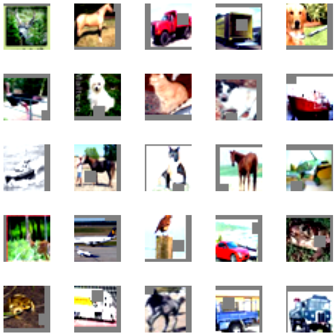
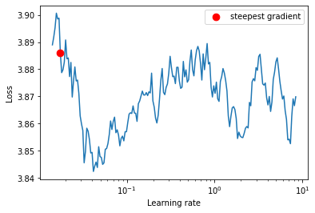
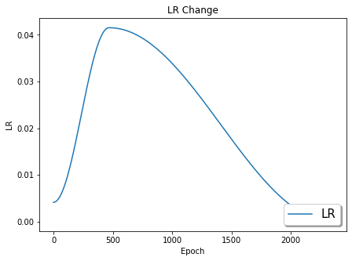
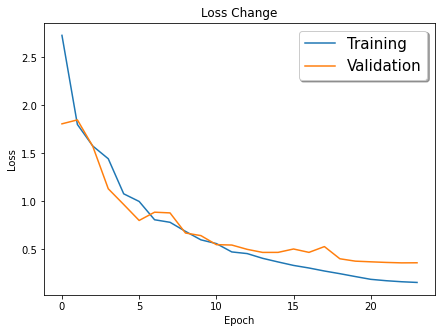
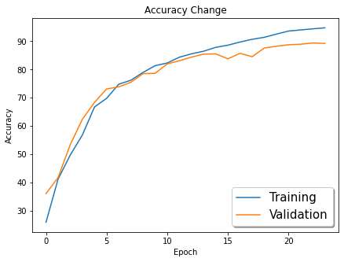

## This is the solution for the assignment 8
There are two important feature of this assignment
1. customization of the RESNET architecture
2. Applying the One Cycle Policy for training the network


## Model 
We have customized the model to create the following architecture
```

PrepLayer - Conv 3x3 s1, p1) >> BN >> RELU [64k]
Layer1 -
    X = Conv 3x3 (s1, p1) >> MaxPool2D >> BN >> RELU [128k]
    R1 = ResBlock( (Conv-BN-ReLU-Conv-BN-ReLU))(X) [128k] 
    Add(X, R1)
Layer 2 -
    Conv 3x3 [256k]
    MaxPooling2D
    BN
    ReLU
Layer 3 -
    X = Conv 3x3 (s1, p1) >> MaxPool2D >> BN >> RELU [512k]
    R2 = ResBlock( (Conv-BN-ReLU-Conv-BN-ReLU))(X) [512k]
    Add(X, R2)
MaxPooling with Kernel Size 4
FC Layer 
SoftMax

```

The implementation is in the [custom_resnet.py](https://github.com/TSAI-EVA8/StarterKit/blob/master/models/custom_resnet.py)


## Code File
I am making use of a code repository [StarterKit](https://github.com/TSAI-EVA8/StarterKit)

* The repo is first cloned in this project using 
```
git clone https://github.com/TSAI-EVA8/StarterKit
```

* The trainiing notebook is [S8_Solution.ipynb](https://github.com/TSAI-EVA8/highReceptiveFields/blob/master/S8_Solution.ipynb) which makes use of the code in the [StarterKit](https://github.com/TSAI-EVA8/StarterKit) to perform the training. All the logic is present in the [StarterKit](https://github.com/TSAI-EVA8/StarterKit)


## Data Set
We have used the CIFAR-10 dataset

## Transformations
The following transformations have been used for the training data
1. RandomCrop(32) with padding of 4
2. RandomHorizontalFlip
3. CutOut (8,8)

The following code implements it
```
transform_train = transforms.Compose(
    [transforms.ToTensor(),  
     transforms.Normalize((0.49139968, 0.48215841, 0.44653091), (0.24703223, 0.24348513, 0.26158784)),
     transforms.RandomCrop(32,4),
     transforms.RandomHorizontalFlip(p = Args.horizontal_flip_prob),
    ])
transform_train.transforms.append(utility.CutOut(n_holes=1, length=8,p=Args.cutout_prob))


```
Since the cutout is not available in the transform library i had to implement it in the code.  [util.py](https://github.com/TSAI-EVA8/StarterKit/blob/master/utils.py)

After the transformation the following images are obtained




## One Cycle Policy

we had to implement the once cycle policy for the training 

1. Use the find_lr function to get the max LR
our max LR is 0.041




2. Now the following policy is applied

* epochs=24
* Max at Epoch = 5 which is implemented using the pct_start=0.2
* LRMAX:  the result of the find_lr
* LRMIN: This is determined by the final_div_factor parameter 
* NO Annihilation: three_phase=False takes care of this

 ```
 torch.optim.lr_scheduler.OneCycleLR(optimizer, 
                                                max_lr=float(ler_rate),
                                                steps_per_epoch=len(train_loader), 
                                                epochs=24,
                                                pct_start=0.2,## how much percent of cycle to use for building up
                                                div_factor=10,## initial learng rate max/div_factor
                                                three_phase=False, ## dont use the annihilation 
                                                final_div_factor=50,## the min rate =inital_lr/final_factor
                                                anneal_strategy='cos'## shape of the cycle
                                                )
```


After the training we can see the learning rate varies in the following manner



## Training Logs


The following are the logs obtained. We can see that there is a slight overfitting as the training accuracy is greater than the testing accuracy. I think the issue is that our training data is not hard enough for making the accuracy to be less at the trainign phase.

```
EPOCH: 1 (LR: 0.004150404757850473)
Batch_id=97 Loss=2.72962 Accuracy=25.86%: 100%|███████████████████████████████████████████████████████████████████████████████████████████████████████████████████████████| 98/98 [00:13<00:00,  7.32it/s]

Test set: Average loss: 1.8078, Accuracy: 3598/10000 (35.98%)

EPOCH: 2 (LR: 0.008025775067461431)
Batch_id=97 Loss=1.80117 Accuracy=41.19%: 100%|███████████████████████████████████████████████████████████████████████████████████████████████████████████████████████████| 98/98 [00:13<00:00,  7.30it/s]

Test set: Average loss: 1.8488, Accuracy: 4173/10000 (41.73%)

EPOCH: 3 (LR: 0.018043636422487283)
Batch_id=97 Loss=1.57596 Accuracy=49.68%: 100%|███████████████████████████████████████████████████████████████████████████████████████████████████████████████████████████| 98/98 [00:13<00:00,  7.29it/s]

Test set: Average loss: 1.5723, Accuracy: 5338/10000 (53.38%)

EPOCH: 4 (LR: 0.030046651596412673)
Batch_id=97 Loss=1.44390 Accuracy=56.79%: 100%|███████████████████████████████████████████████████████████████████████████████████████████████████████████████████████████| 98/98 [00:13<00:00,  7.26it/s]

Test set: Average loss: 1.1311, Accuracy: 6237/10000 (62.37%)

EPOCH: 5 (LR: 0.03905365943671732)
Batch_id=97 Loss=1.07857 Accuracy=66.71%: 100%|███████████████████████████████████████████████████████████████████████████████████████████████████████████████████████████| 98/98 [00:13<00:00,  7.25it/s]

Test set: Average loss: 0.9672, Accuracy: 6834/10000 (68.34%)

EPOCH: 6 (LR: 0.0414917986594284)
Batch_id=97 Loss=0.99910 Accuracy=69.79%: 100%|███████████████████████████████████████████████████████████████████████████████████████████████████████████████████████████| 98/98 [00:13<00:00,  7.17it/s]

Test set: Average loss: 0.8010, Accuracy: 7309/10000 (73.09%)

EPOCH: 7 (LR: 0.04109932639358546)
Batch_id=97 Loss=0.80833 Accuracy=74.79%: 100%|███████████████████████████████████████████████████████████████████████████████████████████████████████████████████████████| 98/98 [00:13<00:00,  7.15it/s]

Test set: Average loss: 0.8871, Accuracy: 7385/10000 (73.85%)

EPOCH: 8 (LR: 0.0401644185115947)
Batch_id=97 Loss=0.78183 Accuracy=76.19%: 100%|███████████████████████████████████████████████████████████████████████████████████████████████████████████████████████████| 98/98 [00:13<00:00,  7.10it/s]

Test set: Average loss: 0.8798, Accuracy: 7546/10000 (75.46%)

EPOCH: 9 (LR: 0.038712049521678074)
Batch_id=97 Loss=0.68738 Accuracy=78.96%: 100%|███████████████████████████████████████████████████████████████████████████████████████████████████████████████████████████| 98/98 [00:13<00:00,  7.09it/s]

Test set: Average loss: 0.6702, Accuracy: 7853/10000 (78.53%)

EPOCH: 10 (LR: 0.036781017044412646)
Batch_id=97 Loss=0.59902 Accuracy=81.36%: 100%|███████████████████████████████████████████████████████████████████████████████████████████████████████████████████████████| 98/98 [00:13<00:00,  7.07it/s]

Test set: Average loss: 0.6432, Accuracy: 7864/10000 (78.64%)

EPOCH: 11 (LR: 0.034422905398862724)
Batch_id=97 Loss=0.56017 Accuracy=82.30%: 100%|███████████████████████████████████████████████████████████████████████████████████████████████████████████████████████████| 98/98 [00:13<00:00,  7.07it/s]

Test set: Average loss: 0.5490, Accuracy: 8199/10000 (81.99%)

EPOCH: 12 (LR: 0.031700707613341074)
Batch_id=97 Loss=0.47316 Accuracy=84.36%: 100%|███████████████████████████████████████████████████████████████████████████████████████████████████████████████████████████| 98/98 [00:13<00:00,  7.11it/s]

Test set: Average loss: 0.5450, Accuracy: 8310/10000 (83.10%)

EPOCH: 13 (LR: 0.028687142671488683)
Batch_id=97 Loss=0.45578 Accuracy=85.56%: 100%|███████████████████████████████████████████████████████████████████████████████████████████████████████████████████████████| 98/98 [00:13<00:00,  7.08it/s]

Test set: Average loss: 0.4999, Accuracy: 8439/10000 (84.39%)

EPOCH: 14 (LR: 0.025462712945643503)
Batch_id=97 Loss=0.40646 Accuracy=86.48%: 100%|███████████████████████████████████████████████████████████████████████████████████████████████████████████████████████████| 98/98 [00:13<00:00,  7.05it/s]

Test set: Average loss: 0.4681, Accuracy: 8546/10000 (85.46%)

EPOCH: 15 (LR: 0.022113553709933044)
Batch_id=97 Loss=0.36865 Accuracy=87.85%: 100%|███████████████████████████████████████████████████████████████████████████████████████████████████████████████████████████| 98/98 [00:13<00:00,  7.03it/s]

Test set: Average loss: 0.4684, Accuracy: 8554/10000 (85.54%)

EPOCH: 16 (LR: 0.018729132179769795)
Batch_id=97 Loss=0.33257 Accuracy=88.62%: 100%|███████████████████████████████████████████████████████████████████████████████████████████████████████████████████████████| 98/98 [00:13<00:00,  7.00it/s]

Test set: Average loss: 0.5037, Accuracy: 8379/10000 (83.79%)

EPOCH: 17 (LR: 0.015399857544080117)
Batch_id=97 Loss=0.30576 Accuracy=89.74%: 100%|███████████████████████████████████████████████████████████████████████████████████████████████████████████████████████████| 98/98 [00:13<00:00,  7.01it/s]

Test set: Average loss: 0.4685, Accuracy: 8574/10000 (85.74%)

EPOCH: 18 (LR: 0.012214665834278294)
Batch_id=97 Loss=0.27432 Accuracy=90.70%: 100%|███████████████████████████████████████████████████████████████████████████████████████████████████████████████████████████| 98/98 [00:13<00:00,  7.07it/s]

Test set: Average loss: 0.5288, Accuracy: 8453/10000 (84.53%)

EPOCH: 19 (LR: 0.009258644146191949)
Batch_id=97 Loss=0.24654 Accuracy=91.41%: 100%|███████████████████████████████████████████████████████████████████████████████████████████████████████████████████████████| 98/98 [00:13<00:00,  7.01it/s]

Test set: Average loss: 0.4019, Accuracy: 8762/10000 (87.62%)

EPOCH: 20 (LR: 0.00661075767989643)
Batch_id=97 Loss=0.21662 Accuracy=92.55%: 100%|███████████████████████████████████████████████████████████████████████████████████████████████████████████████████████████| 98/98 [00:13<00:00,  7.02it/s]

Test set: Average loss: 0.3771, Accuracy: 8825/10000 (88.25%)

EPOCH: 21 (LR: 0.00434174031580624)
Batch_id=97 Loss=0.18767 Accuracy=93.62%: 100%|███████████████████████████████████████████████████████████████████████████████████████████████████████████████████████████| 98/98 [00:13<00:00,  7.01it/s]

Test set: Average loss: 0.3701, Accuracy: 8877/10000 (88.77%)

EPOCH: 22 (LR: 0.0025122050767729586)
Batch_id=97 Loss=0.17324 Accuracy=94.02%: 100%|███████████████████████████████████████████████████████████████████████████████████████████████████████████████████████████| 98/98 [00:13<00:00,  7.02it/s]

Test set: Average loss: 0.3637, Accuracy: 8896/10000 (88.96%)

EPOCH: 23 (LR: 0.001171024952050149)
Batch_id=97 Loss=0.16250 Accuracy=94.41%: 100%|███████████████████████████████████████████████████████████████████████████████████████████████████████████████████████████| 98/98 [00:13<00:00,  7.07it/s]

Test set: Average loss: 0.3592, Accuracy: 8940/10000 (89.40%)

EPOCH: 24 (LR: 0.00035402733671838633)
Batch_id=97 Loss=0.15519 Accuracy=94.77%: 100%|███████████████████████████████████████████████████████████████████████████████████████████████████████████████████████████| 98/98 [00:13<00:00,  7.02it/s]

Test set: Average loss: 0.3601, Accuracy: 8925/10000 (89.25%)


```

We can see that the max lr of 0.041 was achieved in the 6th epoch


## Accuracy & loss plots






## Class level accuracy
The class level accuracy on the entire test data

```
Accuracy of plane : 90 %
Accuracy of   car : 96 %
Accuracy of  bird : 84 %
Accuracy of   cat : 78 %
Accuracy of  deer : 89 %
Accuracy of   dog : 82 %
Accuracy of  frog : 92 %
Accuracy of horse : 91 %
Accuracy of  ship : 94 %
Accuracy of truck : 92 %
```